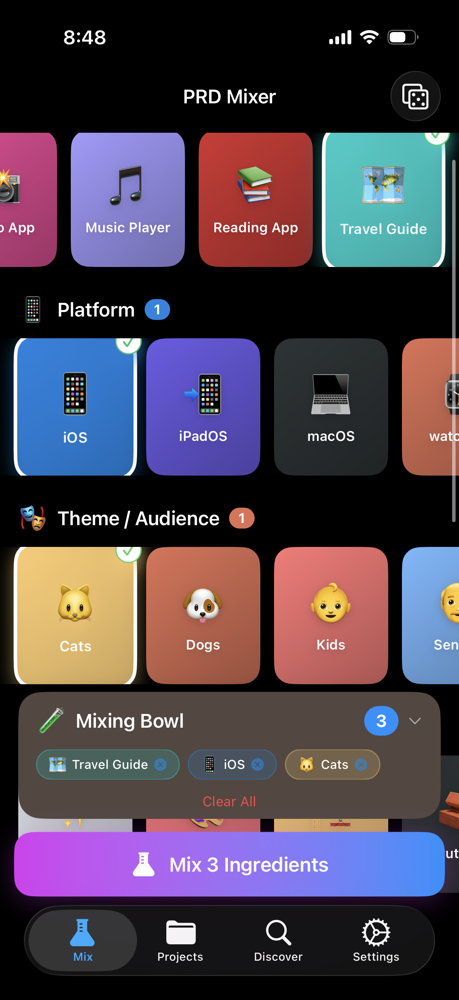
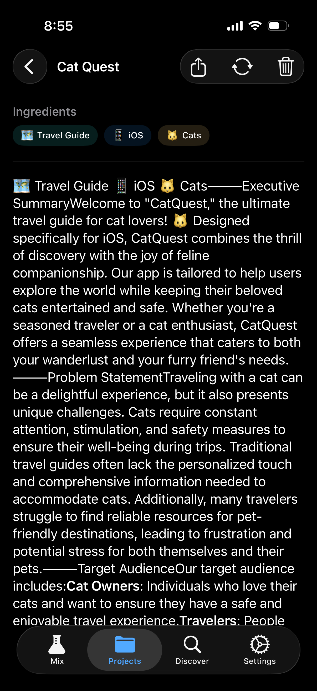
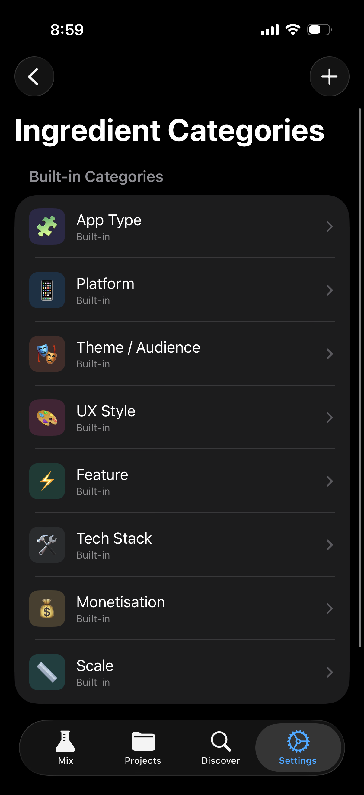

# PRD Mixer

PRD Mixer is an iOS app that transforms PRD (Product Requirements Document) authoring from a blank-page writing task into a playful, tap-driven mixing experience. Select visual, emoji-rich "ingredient" cards from curated categories, and the app generates a complete PRD using Apple's on-device Foundation Model.

**Create a production-ready PRD without ever opening the keyboard.**

[](https://testflight.apple.com/join/RucHUSYd)

## Screenshots

<p align="center">
  
  &nbsp;&nbsp;
  
  &nbsp;&nbsp;
  
</p>

## Features

- **Ingredient Selection** — Browse categorised cards arranged in horizontal rows. Tap to add ingredients to your Mixing Bowl.
- **PRD Generation** — Combine selected ingredients via the on-device Foundation Model to produce a structured Markdown PRD with streaming output.
- **Project Management** — Save, view, and manage generated PRDs. Remix any saved project by loading its ingredients back into the Mix tab.
- **Discover Gallery** — Browse curated pre-made PRDs and remix them as starting points.
- **Surprise Me** — Randomly select one ingredient per category for instant inspiration.
- **Custom Ingredients & Categories** — Create your own ingredients and categories beyond the 78 built-in defaults.
- **System Prompt Customisation** — Edit or create system prompts to control PRD generation style and structure.
- **Share & Export** — Export PRDs as Markdown or plain text via the iOS Share Sheet.

## Requirements

- iOS 26+
- Xcode 26+
- Apple Silicon device (for Foundation Model features)

## Architecture

The app follows MVVM with SwiftUI and SwiftData:

```
PRD Mixer/
├── Models/          Data types and SwiftData persistence models
├── Data/            Static default content (ingredients, categories, prompts)
├── Services/        Business logic (generation, export, haptics)
├── ViewModels/      UI state management and coordination
├── Views/           SwiftUI views organised by tab
└── Extensions/      Swift type extensions
```

Key technical decisions:

- **On-device AI** — All inference runs through the FoundationModels framework. No data leaves the device.
- **Value types for defaults** — Built-in ingredients and categories are static arrays, not SwiftData models, avoiding schema migration complexity.
- **JSON blob storage** — Projects store ingredients as encoded JSON, making them fully self-contained and portable.
- **@Observable** — All view models use the `@Observable` macro for cleaner SwiftUI integration.

See [`docs/`](docs/) for detailed architecture, data model, and UI documentation.

## Prompt Tuner CLI

A companion macOS CLI tool for testing and iterating on system prompts and ingredient categories. Reuses the app's model and data files directly via Swift Package Manager.

```bash
# Build (requires macOS 26+)
swift build --product prompt-tuner

# List categories and ingredients
swift run prompt-tuner list-categories
swift run prompt-tuner list-ingredients --category appType

# Build the full prompt pair (system + user) from ingredient IDs
swift run prompt-tuner build-prompt --ids appType_chat,platform_ios,ux_minimalist --json

# Generate a PRD using the on-device Foundation Model
swift run prompt-tuner generate --ids appType_chat,platform_ios,ux_minimalist
swift run prompt-tuner generate --ids appType_todo,theme_cats --output my_prd.md

# Test with a custom system prompt
swift run prompt-tuner generate --ids appType_chat --system-prompt-file custom_prompt.txt

# Add custom categories and ingredients
swift run prompt-tuner add-category --id monetization --name Monetization --emoji 💰
swift run prompt-tuner add-ingredient --id monetization_freemium --label Freemium --emoji 🆓 --category monetization
```

All commands support `--json` for machine-readable output. Run `swift run prompt-tuner --help` for full usage.

## License

All rights reserved.
